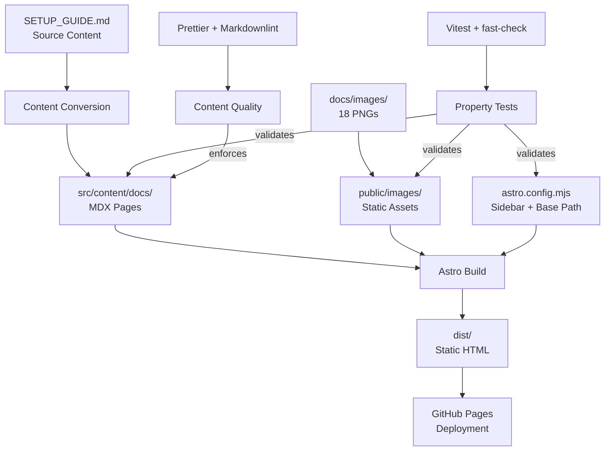
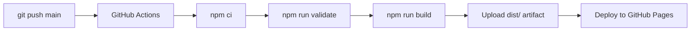

# Design Document

## Overview

This design describes an Astro Starlight documentation site that converts a monolithic 1595-line `SETUP_GUIDE.md` into a multi-page, navigable documentation website deployed to GitHub Pages. The site covers WSL2 + Docker Desktop + Kiro IDE + AWS SSO development environment setup.

The project follows the established patterns from the reference repository `jajera/ecs-express-mode-walkthrough`, using Astro Starlight with MDX content pages, Vitest with fast-check for property-based testing, and GitHub Actions for deployment.

### Design Decisions

1. **Astro Starlight over alternatives (Docusaurus, VitePress)**: Matches the reference repository pattern the maintainer already uses; provides built-in sidebar navigation, search, and responsive design with minimal configuration.
2. **MDX over plain Markdown**: Allows embedding components and richer formatting while maintaining Markdown familiarity.
3. **fast-check for property-based testing**: Matches the reference repository's testing approach; validates structural invariants across all content files rather than checking individual files one by one.
4. **Flat page structure (no nested folders)**: The guide has 8 sequential sections with no deep hierarchy; flat slugs keep the sidebar configuration simple and URLs short.
5. **Images in `public/images/`**: Starlight serves `public/` at the site root; combined with the `base` path, images are referenced as `/kiro-wsl-aws-setup-guide/images/<filename>.png`.

## Architecture



### Build Pipeline Flow



## Components and Interfaces

### 1. Astro Configuration (`astro.config.mjs`)

The central configuration that wires together the Starlight integration, sidebar navigation, and base path.

```javascript
// astro.config.mjs
import { defineConfig } from 'astro/config';
import starlight from '@astrojs/starlight';

export default defineConfig({
  site: 'https://jajera.github.io',
  base: '/kiro-wsl-aws-setup-guide',
  integrations: [
    starlight({
      title: 'Kiro WSL AWS Setup Guide',
      sidebar: [
        { label: 'Introduction', link: '/' },
        { slug: 'windows-host-prerequisites' },
        { slug: 'kiro-ide-extensions' },
        { slug: 'wsl2-linux-distribution-setup' },
        { slug: 'docker-desktop-wsl2-integration' },
        { slug: 'workspace-setup' },
        { slug: 'kiro-workspace-configuration' },
        { slug: 'final-verification' },
        { slug: 'next-steps-quick-reference' },
      ],
    }),
  ],
});
```

### 2. Content Pages (`src/content/docs/`)

Each MDX file maps to one section of the original guide:

| File                                  | Source Section                  | Slug                              |
| ------------------------------------- | ------------------------------- | --------------------------------- |
| `index.mdx`                           | Introduction/Overview           | `/`                               |
| `windows-host-prerequisites.mdx`      | Windows Host Prerequisites      | `windows-host-prerequisites`      |
| `kiro-ide-extensions.mdx`             | Kiro IDE Extensions             | `kiro-ide-extensions`             |
| `wsl2-linux-distribution-setup.mdx`   | WSL2 Linux Distribution Setup   | `wsl2-linux-distribution-setup`   |
| `docker-desktop-wsl2-integration.mdx` | Docker Desktop WSL2 Integration | `docker-desktop-wsl2-integration` |
| `workspace-setup.mdx`                 | Workspace Setup                 | `workspace-setup`                 |
| `kiro-workspace-configuration.mdx`    | Kiro Workspace Configuration    | `kiro-workspace-configuration`    |
| `final-verification.mdx`              | Final Verification              | `final-verification`              |
| `next-steps-quick-reference.mdx`      | Next Steps + Quick Reference    | `next-steps-quick-reference`      |

### 3. Image Assets (`public/images/`)

All 18 PNG screenshots from `docs/images/` are copied to `public/images/` with preserved filenames. In MDX files, images are referenced using standard Markdown syntax:

```markdown

```

### 4. Property-Based Tests (`tests/properties/`)

Tests use Vitest + fast-check to validate structural invariants:

| Test File                     | Responsibility                                                                 |
| ----------------------------- | ------------------------------------------------------------------------------ |
| `frontmatter.test.ts`         | Validates all MDX files have parseable YAML frontmatter with non-empty `title` |
| `image-references.test.ts`    | Validates all image references in MDX files resolve to files in `public/`      |
| `sidebar-consistency.test.ts` | Validates sidebar config entries map to existing MDX files                     |

### 5. Validation Script (`scripts/validate-content.ts`)

A TypeScript script executed by `npm run validate` that runs the combined Prettier check and Markdownlint pass. This mirrors the reference repository's approach of having a dedicated validation entry point for the CI pipeline.

### 6. NPM Scripts Interface

| Script     | Command                               | Purpose                          |
| ---------- | ------------------------------------- | -------------------------------- |
| `dev`      | `astro dev`                           | Local development server         |
| `build`    | `astro build`                         | Production build to `dist/`      |
| `preview`  | `astro preview`                       | Preview production build locally |
| `validate` | `npx tsx scripts/validate-content.ts` | Run formatting and lint checks   |
| `format`   | `prettier --write .`                  | Auto-format all files            |
| `lint`     | `markdownlint-cli2 "src/**/*.mdx"`    | Lint MDX content files           |
| `test`     | `vitest --run`                        | Run property-based tests         |

## Data Models

### MDX Frontmatter Schema

Each MDX page must include YAML frontmatter conforming to Starlight's content schema:

```yaml
---
title: 'Page Title'
---
```

The `title` field is the only required field. Starlight's built-in content collection schema handles validation at build time, but the property tests independently verify this for early feedback.

### Sidebar Configuration Schema

The sidebar is an array of items matching Starlight's sidebar API:

```typescript
type SidebarItem =
  | { label: string; link: string } // Manual link (for index)
  | { slug: string } // Auto-resolved page reference
  | { label: string; items: SidebarItem[] }; // Group (not used in this flat structure)
```

### Project File Structure

```
kiro-wsl-aws-setup-guide/
├── .github/workflows/
│   └── deploy.yml
├── .vscode/
│   └── extensions.json
├── public/
│   └── images/
│       ├── screenshot-01.png
│       └── ... (18 PNG files)
├── scripts/
│   └── validate-content.ts
├── src/
│   └── content/
│       └── docs/
│           ├── index.mdx
│           ├── windows-host-prerequisites.mdx
│           ├── kiro-ide-extensions.mdx
│           ├── wsl2-linux-distribution-setup.mdx
│           ├── docker-desktop-wsl2-integration.mdx
│           ├── workspace-setup.mdx
│           ├── kiro-workspace-configuration.mdx
│           ├── final-verification.mdx
│           └── next-steps-quick-reference.mdx
├── tests/
│   └── properties/
│       ├── frontmatter.test.ts
│       ├── image-references.test.ts
│       └── sidebar-consistency.test.ts
├── .gitignore
├── .markdownlint.json
├── .nvmrc
├── .prettierrc
├── astro.config.mjs
├── package.json
├── tsconfig.json
├── vitest.config.ts
└── README.md
```

## Correctness Properties

_A property is a characteristic or behavior that should hold true across all valid executions of a system—essentially, a formal statement about what the system should do. Properties serve as the bridge between human-readable specifications and machine-verifiable correctness guarantees._

### Property 1: Frontmatter validity

_For any_ MDX file in the `src/content/docs/` directory, parsing its YAML frontmatter SHALL succeed and yield an object containing a `title` field whose value is a non-empty string.

**Validates: Requirements 2.11, 8.1, 8.5**

### Property 2: Image reference resolution

_For any_ Markdown image reference (``) found in any MDX file in the content directory, removing the base path prefix `/kiro-wsl-aws-setup-guide/` from the path SHALL yield a relative path that resolves to an existing file in the `public/` directory.

**Validates: Requirements 3.2, 8.2**

### Property 3: Image alt text completeness

_For any_ Markdown image reference (``) found in any MDX file in the content directory, the alt text portion SHALL be a non-empty string containing at least one word character.

**Validates: Requirements 3.4**

### Property 4: Sidebar-to-file consistency

_For any_ slug referenced in the Starlight sidebar configuration in `astro.config.mjs`, there SHALL exist a corresponding MDX file at `src/content/docs/{slug}.mdx`.

**Validates: Requirements 4.4, 8.3**

## Error Handling

### Build Errors

| Scenario                    | Handling                                                                                       |
| --------------------------- | ---------------------------------------------------------------------------------------------- |
| Missing frontmatter `title` | Astro build fails with content collection validation error; property test catches this earlier |
| Broken image path           | Image renders as broken in browser; property test catches missing files before build           |
| Invalid sidebar slug        | Starlight logs a warning but builds successfully; property test enforces strict consistency    |
| MDX syntax error            | Astro build fails with a parse error pointing to the offending file and line                   |

### CI Pipeline Errors

| Scenario                 | Handling                                                                              |
| ------------------------ | ------------------------------------------------------------------------------------- |
| `npm run validate` fails | Workflow fails before build; no deployment occurs (Requirement 5.5)                   |
| `npm run build` fails    | Workflow fails; no artifact uploaded; no deployment occurs                            |
| Test failure             | `vitest --run` exits non-zero; can be integrated into validate step or run separately |

### Development Errors

| Scenario              | Handling                                                                 |
| --------------------- | ------------------------------------------------------------------------ |
| Node version mismatch | `.nvmrc` file signals required version; `nvm use` resolves automatically |
| Missing dependencies  | `npm ci` fails early with clear error; standard npm resolution           |

## Testing Strategy

### Dual Testing Approach

This project uses two complementary testing strategies:

1. **Property-based tests (Vitest + fast-check)**: Verify universal structural invariants across all content files. These tests generate random selections from the content corpus and verify that properties hold universally.
2. **Build validation (Astro build)**: The Astro build itself serves as an integration test — if content schema violations exist, the build fails.

### Property-Based Testing Configuration

- **Library**: fast-check (matches reference repository)
- **Runner**: Vitest with `--run` flag (single execution, no watch mode)
- **Location**: `tests/properties/`
- **Minimum iterations**: 100 per property test
- **Tag format**: `Feature: kiro-wsl-aws-setup-guide, Property {N}: {description}`

### Test Files

#### `tests/properties/frontmatter.test.ts`

- Reads all MDX files from `src/content/docs/`
- Uses fast-check to sample from the file list
- For each sampled file, extracts YAML frontmatter and asserts:
  - Frontmatter parses without error
  - Parsed object has a `title` key
  - `title` value is a non-empty string
- On failure, reports the file path and specific validation issue
- **Tag**: `Feature: kiro-wsl-aws-setup-guide, Property 1: Frontmatter validity`

#### `tests/properties/image-references.test.ts`

- Reads all MDX files and extracts Markdown image references using regex `!\[([^\]]*)\]\(([^)]+)\)`
- Uses fast-check to sample from the collected image references
- For each sampled reference, asserts:
  - The path after removing base prefix resolves to an existing file in `public/`
  - The alt text is a non-empty string with at least one word character
- **Tags**:
  - `Feature: kiro-wsl-aws-setup-guide, Property 2: Image reference resolution`
  - `Feature: kiro-wsl-aws-setup-guide, Property 3: Image alt text completeness`

#### `tests/properties/sidebar-consistency.test.ts`

- Parses `astro.config.mjs` to extract all slug references from the sidebar config
- Uses fast-check to sample from the extracted slugs
- For each sampled slug, asserts a corresponding MDX file exists at `src/content/docs/{slug}.mdx`
- **Tag**: `Feature: kiro-wsl-aws-setup-guide, Property 4: Sidebar-to-file consistency`

### Validation Script (`scripts/validate-content.ts`)

Runs sequentially:

1. `prettier --check .` — verifies formatting without modifying files
2. `markdownlint-cli2 "src/**/*.mdx"` — lints MDX content

Exit code is non-zero if either step fails, which blocks the CI build.

### npm Script Integration

```
npm run test      → vitest --run (property-based tests)
npm run validate  → npx tsx scripts/validate-content.ts (format + lint)
npm run build     → astro build (full site build with content validation)
```

The CI pipeline runs `validate` then `build`. Tests can be run separately during development or added to the validate step as needed.
